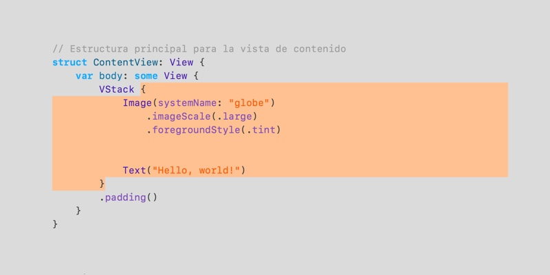
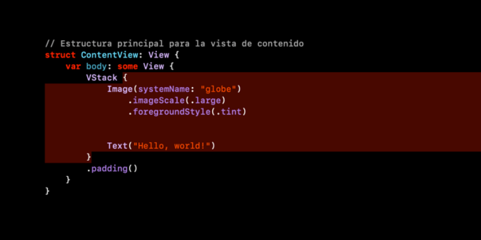

# **Temas para Xcode** ✨

Es una colección de 2 temas para Xcode diseñadas enfocadas en minimalismo y funcionalidad. Incluye los temas: **ClearFocus** y **DeepFocus**.

---

## 📂 **Instalación**

### 🔧 **Requisitos previos**
- Tener **Xcode** instalado en tu Mac.
- Tener acceso a los archivos de temas `.xccolortheme`.

---

### 🖥️ **Pasos para la instalación**

1. **Abre la carpeta de temas en Xcode:**  
   En tu Mac, abre el Finder y navega a la siguiente ruta:  
   ```plaintext
   ~/Library/Developer/Xcode/UserData
   ```
    Una vez ubicado en UserData, hay que abrir la carpeta /FontAndColorThemes
       
    ```plaintext
   ~/Library/Developer/Xcode/UserData/open FontAndColorThemes
   ```

   Si la carpeta no existe, ve a Xcode > Preferences > Settings > Themes, debes crear un tema nuevo duplicanco uno existente, esto creara la carpeta FontAndColorThemes de forma automática e intenta de nuevo con el comando open.
   
    ```plaintext
   open FontAndColorThemes
   ```
   

2. **Adjuntar los temas:**  
   Arrastra los archivos `ClearFocus.xccolortheme` y `DeepFocus.xccolortheme` en la carpeta `FontAndColorThemes`.

3. **Reinicia Xcode:**  
   Si tienes Xcode abierto, ciérralo por completo y vuelve a abrirlo para aplicar los cambios.

4. **Activa el tema en Xcode:**  
   - Ve a `Xcode > Preferences...` (`Cmd + ,`)  
   - En la pestaña **Themes**, selecciona el tema **ClearFocus** o **DeepFocus** de la lista.


---

## 📸 **Vista previa**

Aquí puedes ver cómo se verán los temas.  

### **ClearFocus**
  

### **DeepFocus**
  


---

## ✏️ **Licencia**

Este proyecto se distribuye bajo la licencia [MIT](https://opensource.org/licenses/MIT).

---

¡Espero que disfrutes utilizandolo! 💻✨ 🚀  

